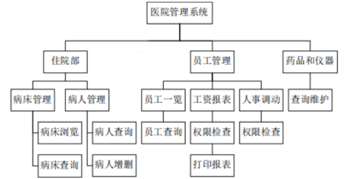

# 医院管理系统

**一、系统需求分析** 

通过一个医院管理系统，使医院的管理工作系统化、规范化、自动化，从而达到提高医院管理效率的目的。 

**1.1 系统功能分析**

医院管理系统需要完成功能主要有： 

l·员工各种信息的输入，包括员工基本信息、职称、岗位等。 

l·员工各种信息的查询、修改，包括员工基本信息、职称、岗位、工资等。 

l·员工的人事调动管理。 

l·病人信息的管理。 

l·医院病床的管理。 

l·药剂资源管理。 

l·仪器资源管理。 

·管理员账户的设定与权限分配。

 

**1.2 系统功能模块设计（划分）** 

医院管理系统分为住院部、员工管理、药品和仪器三个模块。并且有账户权限设定，管理员与用户的权限不同，所以操作界面有区别。其中，该系统分为住院部、员工管理、药品和仪器三大模块。

住院部模块，分为病床管理和病人管理两个界面，每个界面都有增删改查的功能，其中病人信息中的床位号与病床管理的床位号设有主键关系。

员工管理模块，由于登录账户的权限区别，该界面是会有区别的，当登陆者为管理员时，员工管理模块分为个人信息管理，工资管理，岗位/部门管理以及权限管理，每个界面都具备增删改查的功能。而当登陆者为用户时，将只会显示个人的信息查询界面，以及个人的工资查询界面，所拥有的权限仅仅是查询自己的个人信息与工资信息。

药品和仪器管理模块，分为药品管理和仪器管理，各有一个管理界面，同时具备增删改查四个功能。

 

**1.3与其它系统的关系**

 应用程序与数据库连接，当应用程序需要对模块中的数据进行增删改查操作时，应用程序会自动连接数据库，然后再进行操作。

 

1.4 数据流程图 

