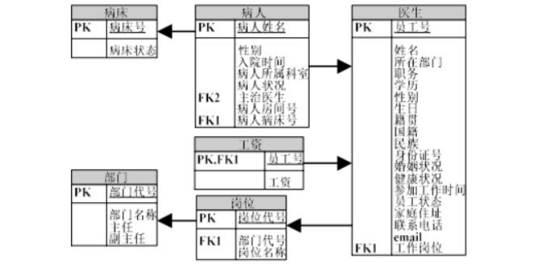

# 医院管理系统

仅仅采用Java SE编写，数据库文件已经导出（hospital.sql）

**一、系统需求分析** 

通过一个医院管理系统，使医院的管理工作系统化、规范化、自动化，从而达到提高医院管理效率的目的。 

**1.1 系统功能分析**

医院管理系统需要完成功能主要有： 

l·员工各种信息的输入，包括员工基本信息、职称、岗位等。 

l·员工各种信息的查询、修改，包括员工基本信息、职称、岗位、工资等。 

l·员工的人事调动管理。 

l·病人信息的管理。 

l·医院病床的管理。 

l·药剂资源管理。 

l·仪器资源管理。 

·管理员账户的设定与权限分配。

 

**1.2 系统功能模块设计（划分）** 

医院管理系统分为住院部、员工管理、药品和仪器三个模块。并且有账户权限设定，管理员与用户的权限不同，所以操作界面有区别。其中，该系统分为住院部、员工管理、药品和仪器三大模块。

住院部模块，分为病床管理和病人管理两个界面，每个界面都有增删改查的功能，其中病人信息中的床位号与病床管理的床位号设有主键关系。

员工管理模块，由于登录账户的权限区别，该界面是会有区别的，当登陆者为管理员时，员工管理模块分为个人信息管理，工资管理，岗位/部门管理以及权限管理，每个界面都具备增删改查的功能。而当登陆者为用户时，将只会显示个人的信息查询界面，以及个人的工资查询界面，所拥有的权限仅仅是查询自己的个人信息与工资信息。

药品和仪器管理模块，分为药品管理和仪器管理，各有一个管理界面，同时具备增删改查四个功能。

 

**1.3与其它系统的关系**

 应用程序与数据库连接，当应用程序需要对模块中的数据进行增删改查操作时，应用程序会自动连接数据库，然后再进行操作。

 

1.4 数据流程图 

**二、数据库设计** 

**2.1 数据库需求分析**

通过对医院管理的内容和数据关系分析，我们设计的数据项和数据结构如下： 

·员工基本状况包括的数据项有员工号、员工姓名、性别、所在部门、身份证号、生日、籍贯、国籍、民族、婚姻状况、健康状况、参加工作时间、员工状态、家庭住址、联系电话等。 

·员工工资状况包括的数据项有员工号、工资项别、工资金额等。 

·医院工作岗位信息包括的数据库项有工作岗位代号、工作岗位名称等。 

·医院部门信息包括的数据项有部门代号、部门名称、部门负责人等。 

·病人信息包括的数据项有病人姓名、病人性别、入院时间、病人所属科室病人状况、病人主治医生、房问号、病床号等。 

·药剂资源管理信息包括的数据项有药剂代号、药剂名称、药剂价格、药剂库存数量、备注等。 

·医疗仪器管理包括的数据项有仪器代号、仪器名称、仪器价格、仪器数量、备注等。 

**2.2 数据库概念结构设计**

本系统根据上面的设计规划出的实体有员工实体、部门实体、岗位实体、病人实体、药剂实体、仪器实体。实体和实体之间的关系 E-R 图模型如图 2 所示。 

​                                                           图2、医院管理系统的E-R图

**三、各功能模块的设计与实现** 

**3.1功能说明**

1、员工信息的管理。 

2、病人信息的管理。 

3、医院病床的管理。 

4、药剂仪器资源的管理。 

5、系统用户管理、权限管理。 

**3.2 用户界面设计**

医院管理系统的窗体分成 17 个主要部分，如下图所示。

1、系统欢迎界面及主界面设计 

2、住院部管理模块主界面 

3、病人管理模块界面设计 

4、病床管理模块界面设计 

